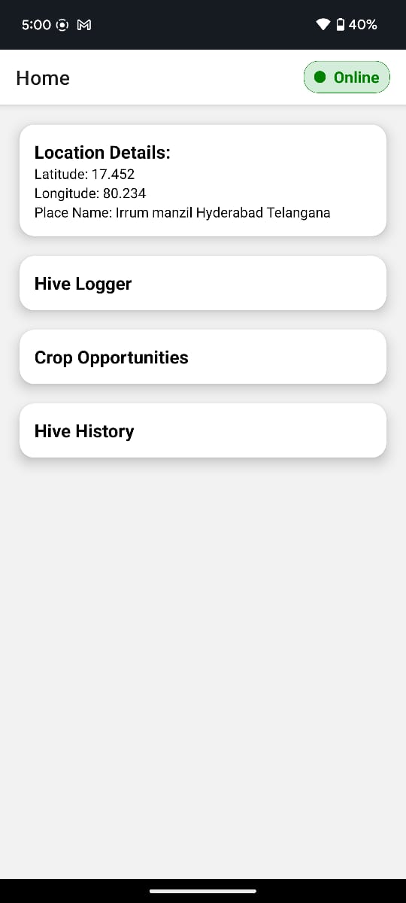

# 🐝 HumbleBee App Development Checklist

This checklist outlines the core, bonus, and edge features to build in the beekeeping tracker app.

---
## 📱 Screenshots
Here are some screenshots of the HumbleBee app:




## 🎥 Demo Video
You can view a demo of the app here:

[Pemission given, online / offline](assets/images/permision%20given%20.mp4)

[Pemission denied](assets/images/no-permisiion%20.mp4)


## ✅ Core Functionality

## 🔄 Sync Strategy for Rural Connectivity

The **HumbleBee** app is built to function reliably in **low-connectivity or offline environments** using **Expo SQLite** and `@react-native-community/netinfo`.

### 🔄 Sync Strategy for Rural Connectivity

The **HumbleBee** app is built to function reliably in **low-connectivity or offline environments** using **Expo SQLite** and `@react-native-community/netinfo`.

#### ⚙️ How Sync Works

1. **Local-first, Offline-Ready**  
   All core features work fully offline. The app stores data using SQLite, allowing users to log hive activity, view crop info, and manage location without an internet connection.

2. **Change Tracking**  
   Sync status is tracked using the `AppMeta` table with a key:

   This marks data as unsynced when changes are made while offline.

3. **Auto Sync on Network Available**  
When the device regains internet connectivity:
- The app checks network status using `NetInfo`.
- It calls `checkAndLogUnsyncedChanges()` to log or sync pending data.
- Once synced, the unsynced flag is reset:
  ```
  INSERT OR REPLACE INTO AppMeta (key, value) VALUES ('has_unsynced_changes', '0');
  ```

4. **Offline Handling**  
If changes occur while offline:
- The app displays a message:  
  > 📴 You are offline. Your changes will be synced when you're back online.

5. **On App Resume or Launch**  
When the app starts or resumes:
- `checkAndLogUnsyncedChanges()` is triggered to detect unsynced data and attempt synchronization if a connection is available.

6. **Future Cloud Sync Support**  
The current implementation logs unsynced data locally but is designed for future integration with:
- REST APIs 
#### 🧪 Developer Notes

- ✅ Sync is triggered when:
- New hive data is added (`markUnsyncedAndMaybeSync`)
- App starts or resumes with an internet connection (`checkAndLogUnsyncedChanges`)
- 🛠 Designed to support rural beekeepers working in areas with limited or unstable network coverage.

---


### 🐝 Hive Logger Screen
- [✅] Create Hive Log screen UI
- [✅] Inputs: Hive ID, Date, Number of Colonies, Auto-detected Location
- [✅] Save hive log data to SQLite
- [✅] Prevent duplicate Hive IDs
- [✅] Validate all fields before saving
- [ ] Associate crop name with hive log (optional but mentioned in filtering criteria)
- [✅] Empty state: “No hives placed yet”

### 🌾 Crop Opportunities Screen
- [✅] Load crop data from local DB or mock JSON
- [✅] Calculate and show distance from user
- [ ] Filter by current & upcoming flowering window (based on today's date)
- [ ] Sort crops by distance (closest first)
- [ ] Display:
  - [✅] Crop name
  - [✅] Flowering window (start–end)
  - [✅] Distance
  - [✅] Recommended hive density
  - [ ] Label for flowering status: “Flowering now” / “Upcoming”
- [✅] Handle empty state: No crops in range

### 📖 Hive History Screen
- [✅] Show all previously logged hive placements
- [ ] Allow filtering:
  - [ ] By Date
  - [ ] By Crop name (if associated)
  - [ ] By Location radius (bonus)
- [✅] Allow deleting a hive log
- [✅] Allow marking a hive as “Ready to Migrate”
- [✅] UI for empty history
- [ ] Crop name display (if associated)

### 📍 Location Permissions & Management
- [✅] Request foreground location permission
- [✅] Handle denial, revoke, or “never ask again” case
- [✅] Fallback to manual location entry
- [✅] Save and reuse location between screens (avoid repeated fetch)

### 📡 Offline Functionality
- [✅] Ensure all core features work without internet
- [✅] Cache crop data locally
- [✅] Show offline banner: “You are offline”
- [✅] Add retry mechanism when connection resumes

---

## 🌟 Bonus Features
- [ ] Add photo attachment for hive site
- [ ] Push notification 3 days before crop flowering
- [ ] Map view for nearby crops and hive sites
- [✅] logging the data in sqlite / Export or simulate sync to BEETRAIL cloud
- [✅] Highlight hives marked “Ready to Migrate”

---

## 🧪 Dev & Testing Checklist
- [✅] Insert dummy Hive Logs for testing
- [✅] Create mock crop JSON data (with structure provided)
- [✅] Use consistent TypeScript types for all queries
- [ ] Add debug tools (test insert/delete/view logs)
- [ ] Handle app resume (background → foreground)
- [ ] Handle edge cases:
  - [✅] No data
  - [ ] Corrupt storage (try-catch fallback)
  - [✅] No crops nearby
- [ ] Optional config/env setup to switch mock/live mode

---

## 🚀 Submission
- [✅] Public GitHub repo with all code
- [ ] Include:
  - [✅] `README.md` with setup instructions
  - [✅] Features implemented
  - [✅] What’s done vs. pending
  - [✅] Screen recording demo
  - [ ] Sync strategy explanation (e.g., for rural network)
